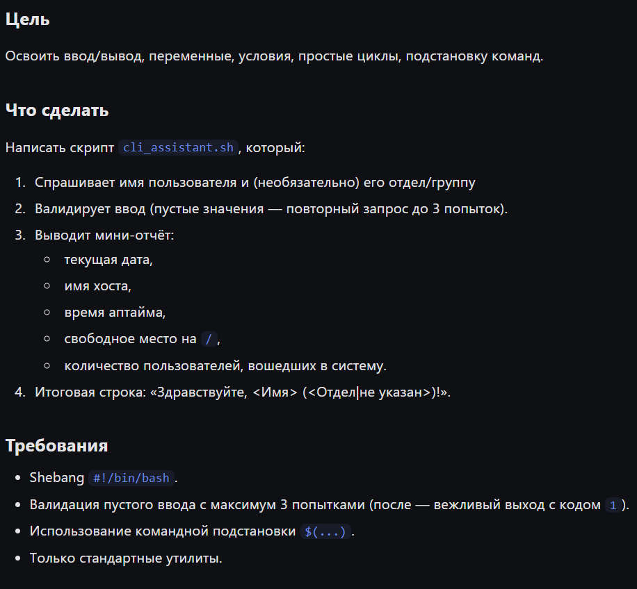
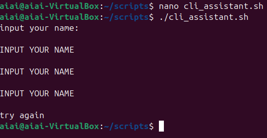
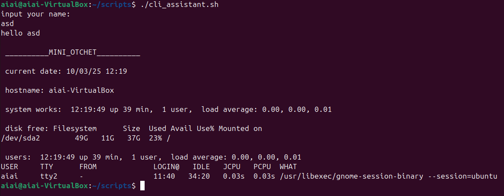
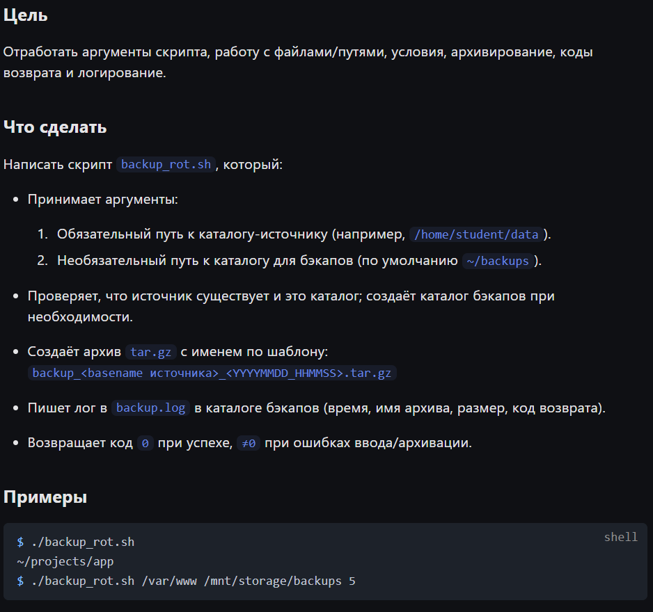
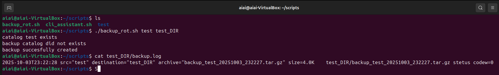
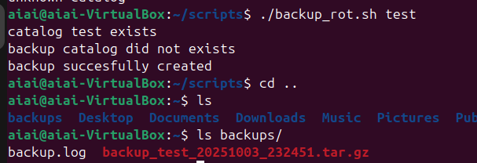

### Задание 1
#### «CLI‑ассистент: приветствие, валидация и мини‑отчёт о системе»



__________________________________

1) запрос + валидация

```bash
#!/bin/bash

echo "input your name: "
read name

attempt=0

while [ $attempt -le 3 ]; do

if [ -z "$name" ]; then   
   if [ $attempt -eq 3 ]; then
   echo "try again"
   break
   fi
   echo "INPUT YOUR NAME"
   attempt=$((attempt+1))
   read name
else
   echo "hello $name"
   break
fi
done

```

> result


_______________


2) Вывод отчета

```bash
echo -e "\n" "__________MINI_OTCHET__________"
echo -e "\n" "current date: $(date '+%m/%d/%y %H:%M')"
echo -e "\n"  "hostname: $(hostname)"
echo -e "\n"  "system works: $(uptime)"
echo -e "\n"  "disk free: $(df -h /)"
echo -e "\n"  "users: $(w)"
```

> результат



> полный скрипт

```bash
#!/bin/bash

echo "input your name: "
read name
attempt=0
while [ $attempt -le 3 ]; do
if [ -z "$name" ]; then
if [ $attempt -eq 3 ]; then
echo "try again"
exit 1
fi
echo "INPUT YOUR NAME"
attempt=$((attempt+1))
read name
else
break
fi
done

echo "input your group (optional):"
read group

if [ -z $group]; then
group="--"
fi

echo -e "\n" "hello $name from ($group)"
echo -e "\n" "__________MINI_OTCHET__________"
echo -e "\n" "current date: $(date '+%m/%d/%y %H:%M')"
echo -e "\n" "hostname: $(hostname)"
echo -e "\n" "system works: $(uptime)"
echo -e "\n" "disk free: $(df -h /)"
echo -e "\n" "users: $(w)"
```

### Задание 2
#### «Резервное копирование каталога с логированием и ротацией»



_________________

1) принятие аргументов

```bash
source="$1"
destination="${2:-$HOME/backups}"
log="$destination/backup.log"
```

2) проверка если каталог существует, и если он был указан в качестве аргумента

```bash
if [ -z "$source" ]; then
echo "catalog did not exist"
exit 1
fi

if [ -d "$source" ]; then
echo "catalog $source exists"
else
echo "unknown catalog"
exit 2
fi
```

3) проверка если указанный каталог существует, если нет - то он создастся

```bash
if [ -d "$destination" ]; then
echo "backup catalog $destination exists"
else
echo "backup catalog did not exists"
mkdir -p "$destination"
fi
```

4) переменные для создания архива и создание архива 

```bash
file_name=$(basename "$source")
saved_at=$(date '+%Y%m%d_%H%M%S')
arc_name="backup_${file_name}_${saved_at}.tar.gz"
path="$destination/$arc_name"

tar -czf "$path" -C "$(dirname "$source")" "$file_name"
```

5) запись размера файла при успевшном создании

```bash
size=0

if [ -f $path ]; then
size=$(du -h "path")
else
size=0
fi
```

6) запись в лог файл по туториалу

```bash
echo "$(date '+%Y-%m-%dT%H:%M:%S') src=\"$source\" destination=\"$destination\" archive=\"$arc_name\" size=$size stetus codew=$code" >> "$log"
```

7) характерный вывод зависащий от кода возврата послежней команды

```bash
if [ $code -eq 0 ]; then
echo "backup succesfully created"
else
echo "backup failed"
fi

exit $code
```

> результаты




