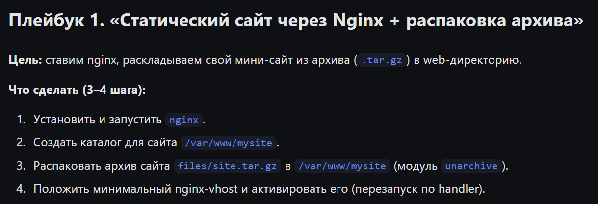
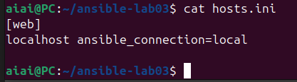
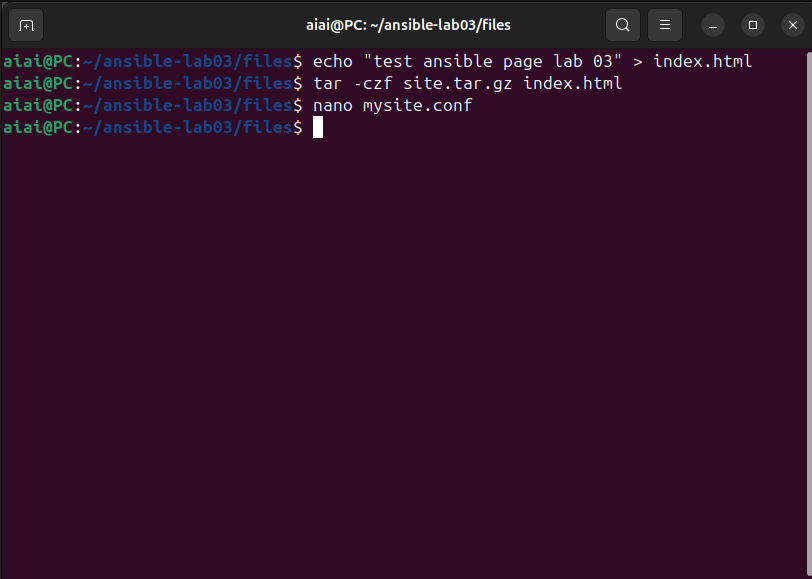
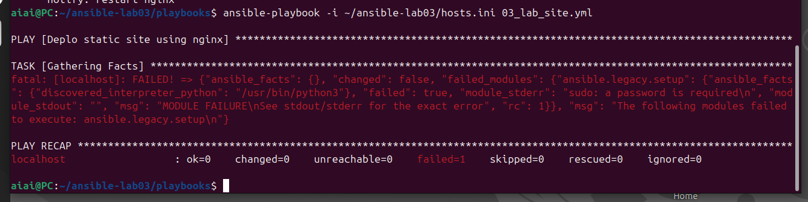
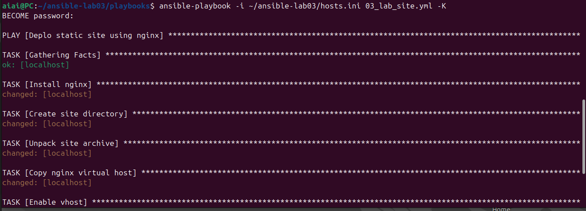
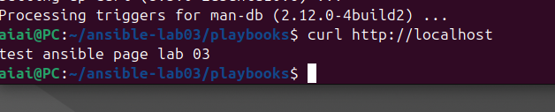
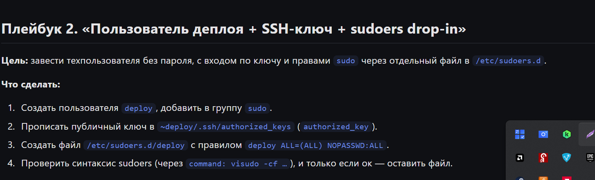
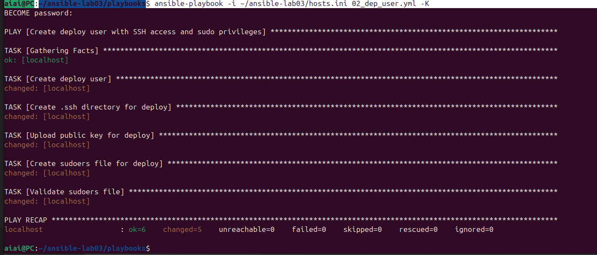

### Плейбук 1



----
контрольное окружение ansible было установлено

----

1) создал inventory файл со своим сервером



2) создаем тестовый файл с сайтом, конф файл для nginx


3) создаем тестовый файл с сайтом, конф файл для nginx



4) создаем плейбук в нужной директории с след содержимым

```yml
- name: Deplo static site using nginx
  hosts: web
  become: yes

  handlers:
    - name: restart nginx
      service:
        name: nginx
        state: restarted

  tasks:
    - name: Install nginx
      apt:
        name: nginx
        state: present
        update_cache: yes

    - name: Create site directory
      file:
        path: /var/www/mysite
        state: directory
        owner: www-data
        group: www-data
        mode: '0755'

    - name: Unpack site archive
      unarchive:
        src: ../files/site.tar.gz
        dest: /var/www/mysite
        remote_src: no

    - name: Copy nginx virtual host
      copy:
        src: ../files/mysite.conf
        dest: /etc/nginx/sites-available/mysite.conf

    - name: Enable vhost
      file:
        src: /etc/nginx/sites-available/mysite.conf
        dest: /etc/nginx/sites-enabled/mysite.conf
        state: link
      notify: restart nginx

    - name: Disable default nginx site
      file:
        path: /etc/nginx/sites-enabled/default
        state: absent
      notify: restart nginx

```
данный плейбук:

1	Устанавливает nginx	пакет nginx
2	Создаёт директорию для сайта	/var/www/mysite
3	Распаковывает архив с сайтом	site.tar.gz → /var/www/mysite
4	Кладёт nginx-конфиг	mysite.conf → /etc/nginx/sites-available/
5	Включает этот конфиг как сайт	создаёт симлинк в /etc/nginx/sites-enabled/
6	Удаляет дефолтный сайт	/etc/nginx/sites-enabled/default

Перезапускает nginx при изменениях	handler restart nginx

4) запускаем плейбук

опача




 

like
_____



✅✅✅✅✅✅
____

Плейбук 2



1) генерим ключ + создаем 2-й плейбук

```bash
aiai@PC:~/ansible-lab03/playbooks$ ssh-keygen -t rsa -b 4096 -f ~/ansible-lab03/files/key -C "key"
Generating public/private rsa key pair.
Enter passphrase (empty for no passphrase): 
Enter same passphrase again: 
Your identification has been saved in /home/aiai/ansible-lab03/files/key
Your public key has been saved in /home/aiai/ansible-lab03/files/key.pub
The key fingerprint is:
SHA256:mpDZovHwwzyxpjT8EwMEkxdqy3DPDkzHC8IAgT0gRas key
The key's randomart image is:
+---[RSA 4096]----+
|@O+.             |
|*o=o             |
|+==.o            |
|+*o= =           |
|Eo=.X . S        |
| . @o= o         |
|  = @oo          |
| . =.o           |
|  . ..           |
+----[SHA256]-----+
aiai@PC:~/ansible-lab03/playbooks$ 
```

yaml file

```bash
---
- name: Create deploy user with SSH access and sudo privileges
  hosts: web
  become: yes

  tasks:
    - name: Create deploy user
      user:
        name: deploy
        shell: /bin/bash
        groups: sudo
        append: yes

    - name: Create .ssh directory for deploy
      file:
        path: /home/deploy/.ssh
        state: directory
        owner: deploy
        group: deploy
        mode: '0700'

    - name: Upload public key for deploy
      authorized_key:
        user: deploy
        state: present
        key: "{{ lookup('file', '../files/key.pub') }}"

    - name: Create sudoers file for deploy
      copy:
        content: "deploy ALL=(ALL) NOPASSWD:ALL"
        dest: /etc/sudoers.d/deploy
        mode: '0440'

    - name: Validate sudoers file
      command: visudo -cf /etc/sudoers.d/deploy

```

Create key user	- Создаёт пользователя key в группе sudo
Create .ssh -	Создаёт директорию .ssh с правильными правами
Upload public key -	Копирует публичный ключ в ~/.ssh/authorized_keys
Configure sudoers rule	- Создаёт отдельный файл в /etc/sudoers.d/ с проверкой синтаксиса через visudo

```bash
aiai@PC:~/ansible-lab03/playbooks$ ansible-playbook -i ~/ansible-lab03/hosts.ini 02_dep_user.yaml -K
ERROR! the playbook: 02_dep_user.yaml could not be found
aiai@PC:~/ansible-lab03/playbooks$ ansible-playbook -i ~/ansible-lab03/hosts.ini 02_dep_user.yml -K
```

_____



✅✅✅✅✅✅
_____